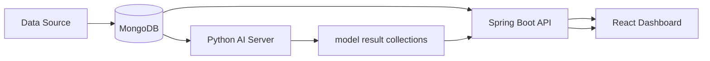

# ML Studio / Insight View Demo

## Overview

This repository is a public portfolio demo of an ML-assisted manufacturing analytics studio. It preserves the application shape of a React dashboard, Spring Boot API, FastAPI model execution service, and MongoDB-backed analytics collections while replacing operational identifiers and data with synthetic demo material.

## Key Features

- AI operation status monitoring
- Dataset configuration
- Feature generation
- Anomaly detection
- Supervised learning result analysis
- Threshold alert monitoring
- Model training policy management
- Data exploration dashboard

## Architecture

## Tech Stack

- React
- TypeScript
- Vite
- Spring Boot
- MongoDB
- FastAPI
- scikit-learn

## Repository Structure

- `apps/web`: React + Vite dashboard
- `apps/api`: Spring Boot API
- `apps/ai-server`: FastAPI model execution service
- `demo-data/seed`: synthetic MongoDB seed examples
- `docs`: architecture, API, data, security, and case study notes
- `scripts`: placeholder for public demo helper scripts

## Demo Data Policy

All data is synthetic demo data. No real customer, facility, equipment, operator, production, IP, credential, or business-sensitive data is included.

## Local Run

1. Copy `.env.example` values into your local shell or your own untracked `.env`.
2. Start MongoDB locally with the `demo_ml_studio_db` database.
3. Run the AI service from `apps/ai-server`.
4. Run the API from `apps/api`.
5. Run the web app from `apps/web`.

## Documentation

- [Architecture](docs/ARCHITECTURE.md)
- [API](docs/API.md)
- [Data Schema](docs/DATA_SCHEMA.md)
- [Data Notice](docs/DATA_NOTICE.md)
- [Security](docs/SECURITY.md)
- [Case Study](docs/CASE_STUDY_ML_STUDIO.md)
- [Reuse Candidates](docs/REUSE_CANDIDATES.md)

## Security Notice

This demo repository intentionally excludes production configuration, private endpoints, deployment history, real database names, credentials, operational data, and brand/customer assets.
