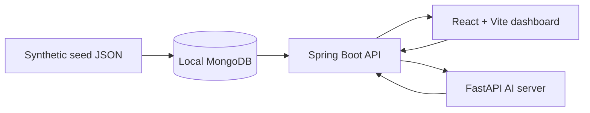

# ML Studio / Insight View Demo

Public portfolio demo for a manufacturing ML analytics studio. The repository shows a React dashboard, Spring Boot API, FastAPI model execution service, synthetic MongoDB seed data, and safety/documentation assets that resemble a real ML Studio / Insight View workflow without copying production code or data.

## Demo Notice

This is not an operations repository. All names, identifiers, timestamps, equipment, lots, parts, users, metrics, and model outputs are synthetic demo data. Public-safe identifiers use `DEMO-*`, for example `DEMO-MC-001`, `DEMO-LOT-001`, `DEMO-PART-001`, `DEMO-RUN-IF-001`, and `DEMO_DATASET_MANUFACTURING_AI`.

## Tech Stack

- Web: React, TypeScript, Vite, MUI
- API: Java 17, Spring Boot, Gradle
- AI server: Python, FastAPI, scikit-learn-compatible deterministic demo logic
- Data: MongoDB-compatible seed JSON under `demo-data/seed`

## Architecture



## Demo Scope

Implemented P0 demo surfaces:

- Home Dashboard: `/`
- AI Overview: `/ai/overview`
- Anomaly Detection Result: `/ai/anomaly`
- Threshold Alert: `/ai/threshold-alert`
- Supervised Learning Result: `/ai/supervised-result`
- Data Exploration: `/data-exploration` redirects to `/data-exploration/timeseries`

The frontend calls the API through `VITE_API_BASE_URL` and keeps fallback/mock behavior where useful for local portfolio review.

## Local Run

Web:

```bash
cd apps/web
npm install
npm run dev
```

API:

```bash
cd apps/api
./gradlew bootRun
```

AI server:

```bash
cd apps/ai-server
python -m pip install -r requirements.txt
uvicorn main:app --host 0.0.0.0 --port 8001
```

Seed data:

```bash
python scripts/seed-demo-data.py --dry-run
python scripts/seed-demo-data.py --uri mongodb://localhost:27017 --db ml_studio_demo
```

Safety scan:

```powershell
powershell -ExecutionPolicy Bypass -File scripts/scan-public-safety.ps1
```

Docker Compose:

```bash
docker compose up
```

## Repository Structure

- `apps/web`: React + Vite dashboard
- `apps/api`: Spring Boot demo API
- `apps/ai-server`: FastAPI demo model execution service
- `demo-data/seed`: synthetic JSON seed data
- `docs`: architecture, API, schema, data notice, security, and case study
- `scripts`: seed loader and public safety scanner
- `docker-compose.yml`: local demo stack

## API Summary

- `GET /api/health`
- `GET /api/home/dashboard`
- `GET /api/modeltrain/overview`
- `GET /api/modeltrain/anomaly/runs`
- `GET /api/modeltrain/anomaly/results`
- `GET /api/threshold-alert/summary`
- `GET /api/threshold-alert/list`
- `GET /api/supervised/result/runs`
- `GET /api/supervised/result/summary`
- `GET /api/supervised/result/predictions`
- `GET /api/data-exploration/datasets`
- `GET /api/equipment/master`
- `GET /health` on the AI server
- `POST /api/model/execute/isolation-forest` on the AI server
- `POST /api/model/execute/random-forest` on the AI server

## Security And Data Policy

The repository intentionally excludes production endpoints, private database URIs, credentials, real customer or facility names, real equipment IDs, real lots/parts, logs, model artifacts, and deployment history. `.env.example` contains localhost-only dummy values.

See `docs/SECURITY.md` and `docs/DATA_NOTICE.md` for the public release policy.
