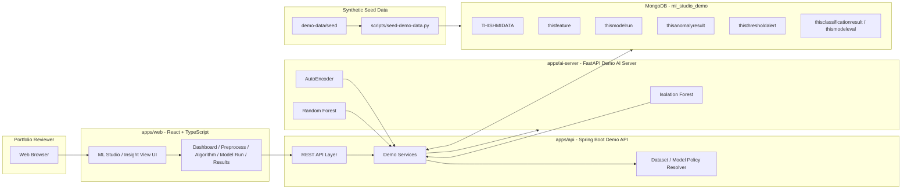
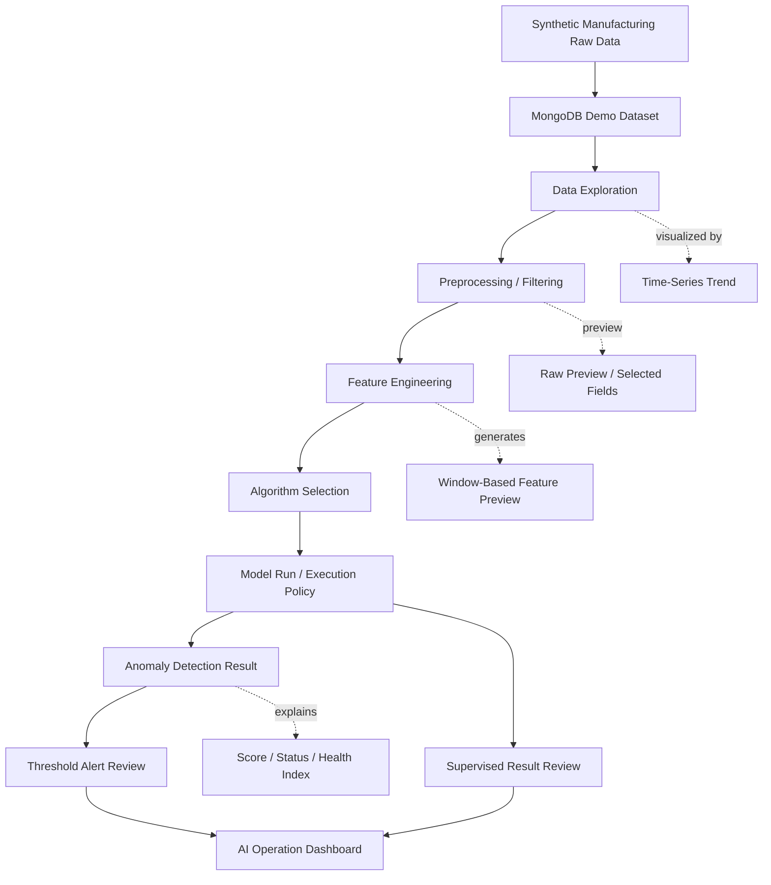

# ML Studio / Insight View Demo

제조 ML 분석 스튜디오의 공개 포트폴리오 데모입니다.

React 대시보드, Spring Boot API, FastAPI 모델 실행 서비스, MongoDB 시드 데이터, 공개 안전 문서를 사용해 ML Studio / Insight View 워크플로의 로컬 합성 버전을 구현했습니다. 원천 공정 데이터에서 전처리, 피처 엔지니어링, 알고리즘 선택, 모델 실행, 이상 탐지, 임계값 알림 검토, 지도학습 결과 시각화에 이르는 제조 AI 분석 파이프라인이 어떻게 구성되는지 보여주도록 설계했습니다.

이 저장소는 공개용으로 재구성한 데모입니다. 운영 저장소가 아니며, 비공개 소스코드나 운영 데이터를 복사한 것이 아닙니다.

## 데모 고지

이 저장소의 모든 이름, 식별자, 타임스탬프, 설비, LOT, 부품, 사용자, 지표, 모델 출력은 합성 데모 데이터입니다.

공개 안전 식별자는 `DEMO-*` 형식을 사용합니다. 예:

- `DEMO-MC-001`
- `DEMO-LOT-001`
- `DEMO-PART-001`
- `DEMO-RUN-IF-001`
- `DEMO_DATASET_MANUFACTURING_AI`

운영 소스코드, 운영 스크린샷, 고객 정보, 실제 공정 데이터, 실제 설비 식별자, 비공개 DB 연결값, 서버 주소, 로그, 모델 아티팩트, 배포 이력, 비공개 접근 자료는 의도적으로 제외했습니다.

## 운영 및 학습 배경

이 데모는 운영·배포된 제조 AI 분석 프로젝트와 관련 제조 AI 모델링 학습 경험을 기반으로 재구성했습니다.

원본 프로젝트는 다음을 위한 AI 기반 제조 데이터 분석 플랫폼 구축에 집중했습니다: 제조 공정 데이터 탐색, 원천 데이터 필터링 및 전처리, AI 분석용 피처 생성, 비지도 이상 탐지, 임계값 기반 알림 모니터링, 지도학습 결과 검토, AI 운영 상태 모니터링, 현장에서 읽기 쉬운 AI 분석 결과 시각화.

핵심 기술 과제는 수집된 공정 데이터를 단순히 표시하는 것이 아니라, 원천 제조 레코드를 AI에 바로 쓸 수 있는 피처와 해석 가능한 결과 화면으로 변환하는 파이프라인을 설계하는 것이었습니다.

구현 및 학습 과정에서 다룬 실무 주제:

- 원천 공정 데이터에서 의미 있는 제조 변수 식별
- 데이터셋·설비·시간 범위·센서 필드 기준 공정 레코드 필터링
- 시간 윈도 기반 피처 엔지니어링
- 비지도 이상 탐지와 지도학습 분류 워크플로 비교
- AI 출력을 원천 모델 결과가 아닌 현장 친화적 대시보드로 표현
- 공개 데모 데이터와 비공개 운영 데이터 분리
- 배포된 AI 플랫폼의 포트폴리오 안전 합성 버전 설계

공개 데모는 이 개념들을 로컬·합성·포트폴리오 안전 애플리케이션으로 변환한 것입니다.

## 데모 범위

로컬 전용 스택으로 합성 제조 AI 워크플로를 보여줍니다.

구현된 데모 화면:

- Home Dashboard: `/`
- AI Overview: `/ai/overview`
- Preprocess / Feature Engineering: `/operation/preprocess`
- Algorithm Selection: `/operation/algorithm`
- Model Training / Run Policy: `/operation/modeltrain`
- Anomaly Detection Result: `/ai/anomaly`
- Threshold Alert: `/ai/threshold-alert`
- Supervised Learning Result: `/ai/supervised-result`
- Data Exploration: `/data-exploration` (→ `/data-exploration/timeseries` 리다이렉트)

프론트엔드는 `VITE_API_BASE_URL`을 통해 Spring Boot API를 호출합니다. 로컬 포트폴리오 검토에 유용한 경우 데모 안전 fallback 동작도 포함합니다.

이 데모는 운영 수준 모델 정확도, 운영 스케줄링, 실제 설비 연동, 고객별 공정 로직을 제공하지 않습니다. 목적은 제조 AI 워크플로를 눈으로 보고 검토할 수 있게 하는 것입니다.

## 기술 스택

- Web: React, TypeScript, Vite, MUI
- API: Java 17, Spring Boot, Gradle
- AI 서버: Python, FastAPI, 결정론적(deterministic) 데모 모델 실행
- Data: `demo-data/seed`의 MongoDB 호환 시드 JSON
- 런타임: Docker Compose, 로컬 MongoDB
- 문서: Markdown, Mermaid 다이어그램
- 시각화: 차트 기반 대시보드 컴포넌트

## 아키텍처



Spring Boot API는 React UI, MongoDB 데모 데이터셋, FastAPI 모델 실행 서버 사이의 데모 파사드 역할을 합니다. 공개 데모는 합성 시드 데이터와 결정론적 데모 응답으로 AI 워크플로를 보여주며, 운영 데이터·인프라·비공개 모델 구성을 노출하지 않습니다.

## AI 파이프라인



### 파이프라인 단계

| 단계 | 설명 |
| --- | --- |
| Raw Data | MongoDB에 저장된 합성 제조 공정 레코드 |
| Data Exploration | 시계열 추세 검토 및 필드 단위 공정 데이터 점검 |
| Preprocessing / Filtering | 데이터셋·설비·시간 범위·필드 선택 워크플로 |
| Feature Engineering | 윈도 기반 합성 피처 미리보기 및 피처 데이터셋 검토 |
| Algorithm Selection | Isolation Forest, AutoEncoder, Random Forest 데모 정책 선택 |
| Model Run | 합성 모델 실행 레코드 및 활성 실행 정책 요약 |
| Anomaly Detection | 이상 점수, 상태 분포, 헬스 인덱스, 결과 테이블 |
| Threshold Alert | 임계값 기반 알림 요약 및 알림 목록 |
| Supervised Result | 합성 분류 지표, 예측 분포, 결과 검토 |
| AI Overview | 활성 모델, 최근 실행, 신호 하이라이트, AI 운영 요약 |

## 스크린샷

### AI Operation Overview


### Preprocess / Feature Engineering


### Algorithm Selection


### Model Training / Run Policy


### Anomaly Detection Result


### Time-Series Data Exploration


### Supervised Learning Result


## 로컬 실행

### 1. MongoDB 시작

```powershell
docker compose up -d mongo
```

### 2. 합성 시드 데이터 로드

```powershell
python scripts\seed-demo-data.py --dry-run
python scripts\seed-demo-data.py --uri mongodb://localhost:27017 --db ml_studio_demo
```

### 3. AI 서버 시작

```powershell
cd apps\ai-server
python -m pip install -r requirements.txt
python -m uvicorn main:app --host 0.0.0.0 --port 8001
```

기본 AI 서버 포트: `8001`. 헬스 체크:

```powershell
Invoke-RestMethod http://localhost:8001/health
```

### 4. Spring Boot API 시작

새 PowerShell 세션에서:

```powershell
cd apps\api
.\gradlew.bat bootRun
```

기본 API 포트: `8090`. 헬스 체크:

```powershell
Invoke-RestMethod http://localhost:8090/api/health
```

### 5. 프론트엔드 시작

또 다른 PowerShell 세션에서:

```powershell
cd apps\web
npm install
npm run dev
```

기본 웹 포트: `5173`. 접속: `http://localhost:5173`

### 데모 로그인

다음 중 하나 사용:

- 계정: `admin / admin`
- 버튼: `Demo Login`

## 샘플 데이터

합성 시드 데이터는 `demo-data/seed`에 저장되어 있으며, 다음으로 로드합니다:

```powershell
python scripts\seed-demo-data.py --uri mongodb://localhost:27017 --db ml_studio_demo
```

공개 데모 데이터셋 키: `DEMO_DATASET_MANUFACTURING_AI`

주요 합성 컬렉션:

```text
THISHMIDATA, TMSTMC, tmst_dataset_config, tmst_data_type_mst,
tmst_data_type, tmst_data_type_dtl, tmst_feature_mst, thisfeature,
tmst_algo_mst, tmst_algo_dtl, tmst_map_algo, tmst_param_mst,
tmst_map_algo_param, tmst_model_policy, tmst_model_active, thismodelrun,
thisanomalyresult, thisthresholdalert, thisclassificationresult, thismodeleval
```

시드 데이터는 반복적인 로컬 스크린샷과 대시보드 검토가 가능하도록 결정론적으로 구성되어 있습니다.

## 백엔드 API

Spring Boot 백엔드: `apps/api`

기본 설정:

- Java 17 / Spring Boot 3.x
- 서버 포트: `8090`
- MongoDB URI: `${MONGODB_URI:mongodb://localhost:27017/ml_studio_demo}`
- CORS origin: `http://localhost:5173`

실행 / 빌드:

```powershell
cd apps\api
.\gradlew.bat bootRun
.\gradlew.bat build -x test
```

대표 API 엔드포인트:

```text
GET  /api/health
GET  /api/home/dashboard
GET  /api/modeltrain/overview
GET  /api/modeltrain/anomaly/runs
GET  /api/modeltrain/anomaly/results
GET  /api/threshold-alert/summary
GET  /api/threshold-alert/list
GET  /api/supervised/result/runs
GET  /api/supervised/result/summary
GET  /api/supervised/result/predictions
GET  /api/data-exploration/datasets
GET  /api/data-exploration/timeseries/fields
POST /api/data-exploration/timeseries/query
GET  /api/preprocess/data-sources
GET  /api/preprocess/raw-preview
GET  /api/preprocess/features
GET  /api/algorithms/selection
GET  /api/algorithm/params
GET  /api/equipment/master
```

## AI 서버

FastAPI AI 서버: `apps/ai-server`

합성 파이프라인을 위한 데모 안전 모델 실행 엔드포인트(Isolation Forest, AutoEncoder, Random Forest)를 제공합니다.

실행 / 컴파일 체크:

```powershell
cd apps\ai-server
python -m pip install -r requirements.txt
python -m uvicorn main:app --host 0.0.0.0 --port 8001
python -m compileall .
```

대표 엔드포인트:

```text
GET  /health
POST /api/model/execute/isolation-forest
POST /api/model/execute/autoencoder
POST /api/model/execute/random-forest
```

AI 서버는 로컬 시연 전용입니다. 운영 모델 파일, 운영 학습 데이터, 고객별 모델 파라미터를 포함하지 않습니다.

## 프론트엔드

React 프론트엔드: `apps/web`

실행 / 빌드:

```powershell
cd apps\web
npm install
npm run dev
npm run build
```

포트폴리오 검토용 데모 안전 로그인 플로를 포함합니다. 운영 인증, 고객 계정, 사용자 관리, 실제 인가 로직은 제공하지 않습니다.

주요 화면: Home Dashboard, AI Overview, Preprocess / Feature Engineering, Algorithm Selection, Model Training / Run Policy, Anomaly Detection Result, Threshold Alert, Supervised Learning Result, Time-Series Data Exploration.

## 저장소 구조

```text
ml-studio-insight-view-demo
├─ apps
│  ├─ web          # React + Vite 대시보드
│  ├─ api          # Spring Boot 데모 API
│  └─ ai-server    # FastAPI 데모 모델 실행 서비스
├─ demo-data
│  └─ seed         # 합성 JSON 시드 데이터
├─ docs            # 아키텍처, API, 스키마, 데이터 고지, 보안, 케이스 스터디
├─ screenshots     # README용 공개 합성 데모 스크린샷
├─ scripts         # 시드 로더 및 공개 안전 스캐너
├─ docker-compose.yml
└─ README.md
```

## 검증

```powershell
powershell -ExecutionPolicy Bypass -File scripts\scan-public-safety.ps1   # 공개 안전 스캔
python scripts\seed-demo-data.py --dry-run                                # 시드 dry-run
```

프론트엔드/백엔드/AI 서버 빌드 검증은 위 각 섹션의 빌드 명령을 사용합니다.

## 보안 및 데이터 정책

이 저장소는 다음을 의도적으로 제외합니다: 운영 엔드포인트, 비공개 DB URI, 비공개 접근 자료, 실제 고객·시설명, 실제 설비 ID, 실제 LOT·부품, 실제 공정 레코드, 런타임 로그, 모델 아티팩트, 배포 이력, 비공개 저장소 히스토리.

`.env.example`은 localhost 전용 더미 값만 포함합니다. 운영 `.env` 파일, DB 덤프, 로그, 고객 스크린샷, 실제 모델 아티팩트, 운영 구성 파일을 추가하지 마십시오.

합성 데모 데이터는 `demo-data/seed`에만, 공개 합성 스크린샷은 `screenshots`에만 둡니다.

상세: `docs/SECURITY.md` · `docs/DATA_NOTICE.md`

## 문서

| 문서 | 설명 |
| --- | --- |
| [Architecture](docs/ARCHITECTURE.md) | 시스템 아키텍처 및 데이터 흐름 |
| [API Reference](docs/API.md) | 백엔드 API 엔드포인트 및 응답 형식 |
| [Data Schema](docs/DATA_SCHEMA.md) | MongoDB 데모 스키마 및 컬렉션 구조 |
| [Security Notice](docs/SECURITY.md) | 보안, 익명화, 공개 정책 |
| [Data Notice](docs/DATA_NOTICE.md) | 합성 데이터 및 데이터 처리 고지 |
| [Case Study](docs/CASE_STUDY_ML_STUDIO.md) | 익명화된 ML Studio / Insight View 케이스 스터디 |
| [Reuse Candidates](docs/REUSE_CANDIDATES.md) | 재사용 가능 모듈 및 확장 후보 |

## 공개 데모 관계

이 저장소는 공개 합성 재구성 버전입니다. 제조 ML 분석 플랫폼의 핵심 엔지니어링 개념을 보여주되, 비공개 구현 세부를 데모 안전 데이터, 로컬 런타임 기본값, 공개 문서로 대체했습니다.

목표는 다음 엔지니어링 워크플로를 보여주는 것입니다:

```text
원천 제조 데이터
→ 데이터 탐색
→ 전처리 / 필터링
→ 피처 엔지니어링
→ 알고리즘 선택
→ 모델 실행
→ 이상 탐지 결과
→ 임계값 / 지도학습 결과 검토
→ AI 운영 대시보드
```

운영 배포 패키지가 아니라 포트폴리오 데모로 검토해 주십시오.
