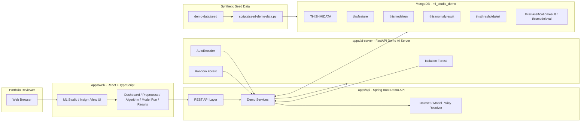
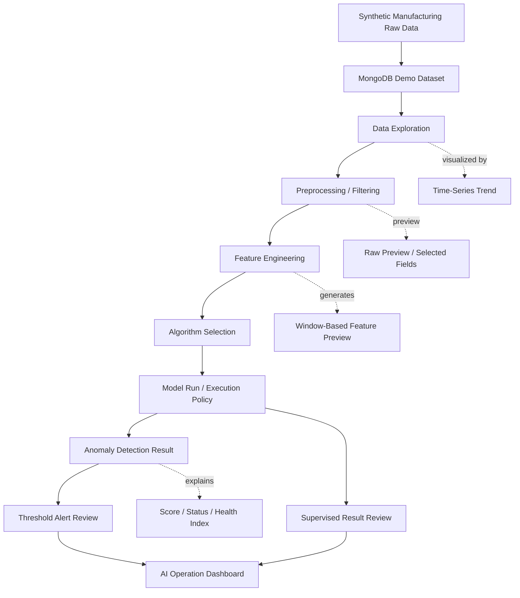
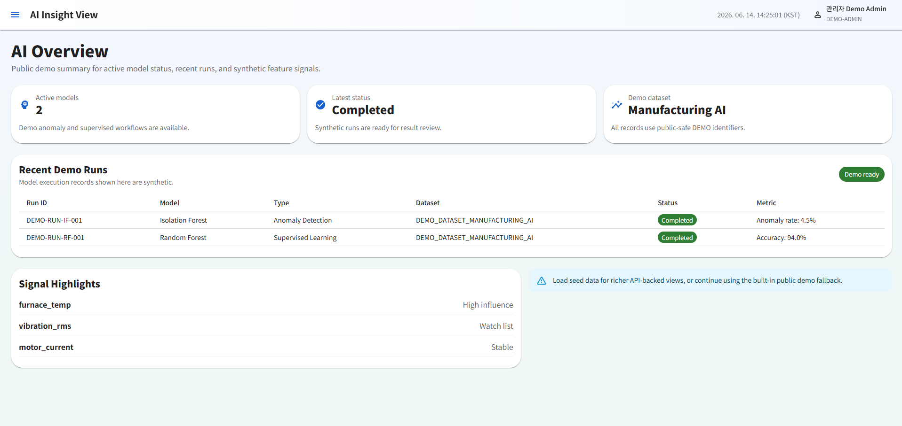
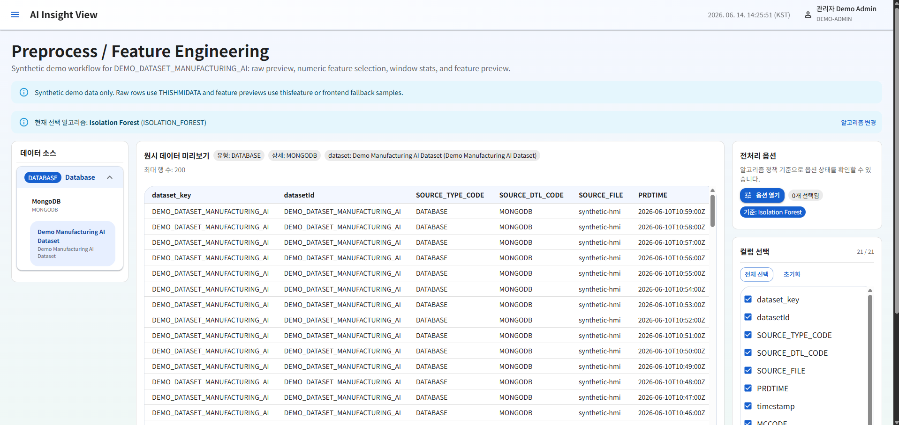
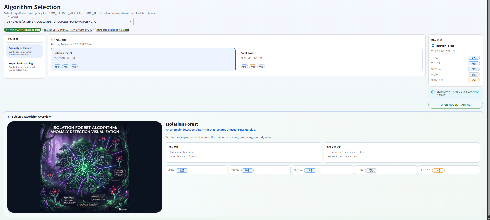
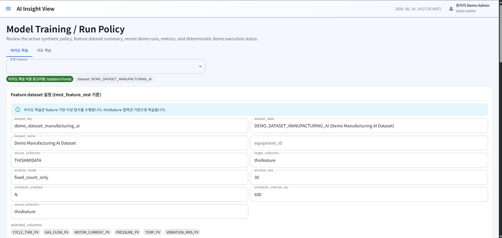
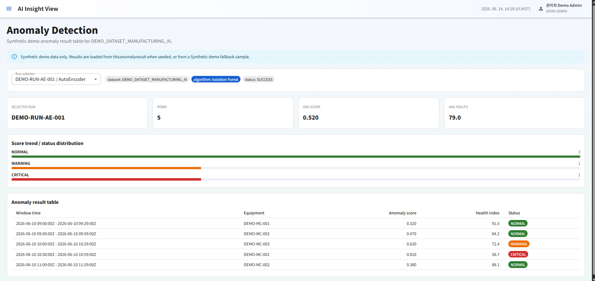
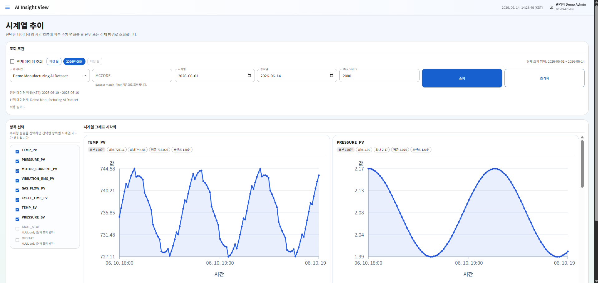
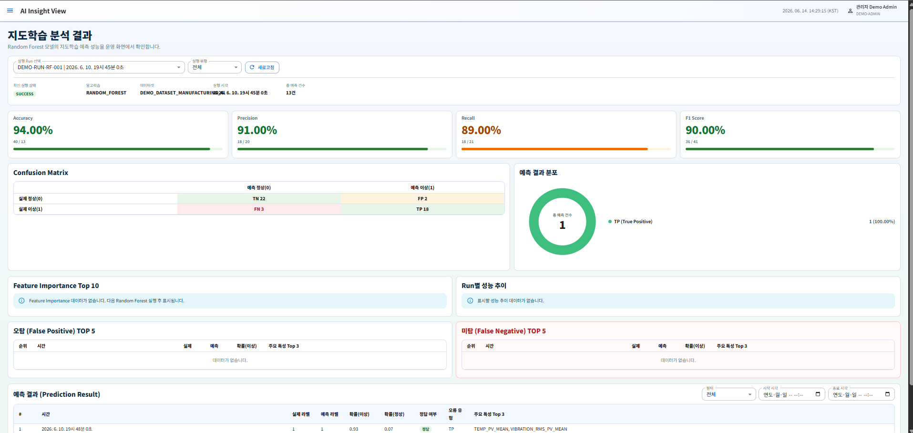

# ML Studio / Insight View Demo

Public portfolio demo for a manufacturing ML analytics studio.

This repository demonstrates a local synthetic version of an ML Studio / Insight View workflow using a React dashboard, Spring Boot API, FastAPI model execution service, MongoDB seed data, and public-safe documentation. It is designed to show how a manufacturing AI analysis pipeline can be structured from raw process data to preprocessing, feature engineering, algorithm selection, model execution, anomaly detection, threshold alert review, and supervised learning result visualization.

This repository is a rebuilt public demo. It is not a production operations repository and is not a copy of private source code or production data.

## Demo Notice

All names, identifiers, timestamps, equipment, lots, parts, users, metrics, and model outputs in this repository are synthetic demo data.

Public-safe identifiers use `DEMO-*`, for example:

* `DEMO-MC-001`
* `DEMO-LOT-001`
* `DEMO-PART-001`
* `DEMO-RUN-IF-001`
* `DEMO_DATASET_MANUFACTURING_AI`

The repository intentionally excludes production source code, production screenshots, customer-specific information, real process data, real equipment identifiers, private database connection values, server addresses, logs, model artifacts, deployment history, and private access material.

## Production & Learning Background

This public demo was rebuilt from experience gained during a deployed manufacturing AI analytics project and related manufacturing AI modeling study.

The original project focused on building an AI-assisted manufacturing data analysis platform for:

* Manufacturing process data exploration
* Raw data filtering and preprocessing
* Feature generation for AI analysis
* Unsupervised anomaly detection
* Threshold-based alert monitoring
* Supervised learning result review
* AI operation status monitoring
* Field-readable visualization of AI analysis results

The main technical challenge was not only displaying collected process data, but also designing a pipeline that could transform raw manufacturing records into AI-ready features and interpretable result screens.

The implementation and study process focused on practical manufacturing AI topics:

* Manufacturing process data structure analysis
* Sensor and process variable filtering
* Time-windowed feature engineering
* Unsupervised anomaly detection workflow
* Supervised classification result interpretation
* Threshold alert design
* AI model run monitoring
* Manufacturing data visualization for field users

The public demo converts those concepts into a local, synthetic, portfolio-safe application.

## Demo Scope

The demo shows a synthetic manufacturing AI workflow using a local-only stack.

Implemented demo surfaces:

* Home Dashboard: `/`
* AI Overview: `/ai/overview`
* Preprocess / Feature Engineering: `/operation/preprocess`
* Algorithm Selection: `/operation/algorithm`
* Model Training / Run Policy: `/operation/modeltrain`
* Anomaly Detection Result: `/ai/anomaly`
* Threshold Alert: `/ai/threshold-alert`
* Supervised Learning Result: `/ai/supervised-result`
* Data Exploration: `/data-exploration` redirects to `/data-exploration/timeseries`

The frontend calls the Spring Boot API through `VITE_API_BASE_URL`. The application also includes demo-safe fallback behavior where useful for local portfolio review.

This demo is not intended to provide production-grade model accuracy, production scheduling, real equipment integration, or customer-specific process logic. Its purpose is to make the manufacturing AI workflow visible and reviewable.

## Tech Stack

* Web: React, TypeScript, Vite, MUI
* API: Java 17, Spring Boot, Gradle
* AI server: Python, FastAPI, deterministic demo model execution
* Data: MongoDB-compatible seed JSON under `demo-data/seed`
* Runtime: Docker Compose, local MongoDB
* Documentation: Markdown, Mermaid diagrams
* Visualization: chart-based dashboard components

## Architecture



The Spring Boot API acts as the demo facade between the React UI, MongoDB demo dataset, and FastAPI model execution server. The public demo uses synthetic seed data and deterministic demo responses to show the AI workflow without exposing production data, infrastructure, or private model configuration.

## AI Pipeline



### Pipeline Stages

| Stage                     | Description                                                                  |
| ------------------------- | ---------------------------------------------------------------------------- |
| Raw Data                  | Synthetic manufacturing process records stored in MongoDB                    |
| Data Exploration          | Time-series trend review and field-level process data inspection             |
| Preprocessing / Filtering | Dataset, equipment, time range, and field selection workflow                 |
| Feature Engineering       | Window-based synthetic feature preview and feature dataset review            |
| Algorithm Selection       | Demo policy selection for Isolation Forest, AutoEncoder, and Random Forest   |
| Model Run                 | Synthetic model run records and active execution policy summary              |
| Anomaly Detection         | Anomaly score, status distribution, health index, and result table           |
| Threshold Alert           | Threshold-based alert summary and alert list                                 |
| Supervised Result         | Synthetic classification metrics, prediction distribution, and result review |
| AI Overview               | Active model, recent run, signal highlight, and AI operation summary         |

## Screenshots

### AI Operation Overview



### Preprocess / Feature Engineering



### Algorithm Selection



### Model Training / Run Policy



### Anomaly Detection Result



### Time-Series Data Exploration



### Supervised Learning Result



## Local Run

### 1. Start MongoDB

```powershell
docker compose up -d mongo
```

### 2. Load synthetic seed data

```powershell
python scripts\seed-demo-data.py --dry-run
python scripts\seed-demo-data.py --uri mongodb://localhost:27017 --db ml_studio_demo
```

### 3. Start the AI server

```powershell
cd apps\ai-server
python -m pip install -r requirements.txt
python -m uvicorn main:app --host 0.0.0.0 --port 8001
```

Default local AI server port: `8001`.

Health check:

```powershell
Invoke-RestMethod http://localhost:8001/health
```

### 4. Start the Spring Boot API

Open a new PowerShell session:

```powershell
cd apps\api
.\gradlew.bat bootRun
```

Default local API port: `8090`.

Health check:

```powershell
Invoke-RestMethod http://localhost:8090/api/health
```

### 5. Start the frontend

Open another PowerShell session:

```powershell
cd apps\web
npm install
npm run dev
```

Default local web port: `5173`.

Open:

```text
http://localhost:5173
```

### Demo Login

Use either option:

* Account: `admin / admin`
* Button: `Demo Login`

## Sample Data

Synthetic seed data is stored under:

```text
demo-data/seed
```

Load it with:

```powershell
python scripts\seed-demo-data.py --uri mongodb://localhost:27017 --db ml_studio_demo
```

The canonical public demo dataset key is:

```text
DEMO_DATASET_MANUFACTURING_AI
```

Main synthetic collections include:

* `THISHMIDATA`
* `TMSTMC`
* `tmst_dataset_config`
* `tmst_data_type_mst`
* `tmst_data_type`
* `tmst_data_type_dtl`
* `tmst_feature_mst`
* `thisfeature`
* `tmst_algo_mst`
* `tmst_algo_dtl`
* `tmst_map_algo`
* `tmst_param_mst`
* `tmst_map_algo_param`
* `tmst_model_policy`
* `tmst_model_active`
* `thismodelrun`
* `thisanomalyresult`
* `thisthresholdalert`
* `thisclassificationresult`
* `thismodeleval`

The seed data is deterministic enough for repeatable local screenshots and dashboard review.

## Backend API

The Spring Boot backend lives in:

```text
apps/api
```

Configuration defaults:

* Java 17
* Spring Boot 3.x
* Server port: `8090`
* MongoDB URI: `${MONGODB_URI:mongodb://localhost:27017/ml_studio_demo}`
* CORS origin: `http://localhost:5173`

Run:

```powershell
cd apps\api
.\gradlew.bat bootRun
```

Build:

```powershell
cd apps\api
.\gradlew.bat build -x test
```

Representative API areas:

* `GET /api/health`
* `GET /api/home/dashboard`
* `GET /api/modeltrain/overview`
* `GET /api/modeltrain/anomaly/runs`
* `GET /api/modeltrain/anomaly/results`
* `GET /api/threshold-alert/summary`
* `GET /api/threshold-alert/list`
* `GET /api/supervised/result/runs`
* `GET /api/supervised/result/summary`
* `GET /api/supervised/result/predictions`
* `GET /api/data-exploration/datasets`
* `GET /api/data-exploration/timeseries/fields`
* `POST /api/data-exploration/timeseries/query`
* `GET /api/preprocess/data-sources`
* `GET /api/preprocess/raw-preview`
* `GET /api/preprocess/features`
* `GET /api/algorithms/selection`
* `GET /api/algorithm/params`
* `GET /api/equipment/master`

## AI Server

The FastAPI AI server lives in:

```text
apps/ai-server
```

It provides demo-safe model execution endpoints for the synthetic pipeline:

* Isolation Forest
* AutoEncoder
* Random Forest

Run:

```powershell
cd apps\ai-server
python -m pip install -r requirements.txt
python -m uvicorn main:app --host 0.0.0.0 --port 8001
```

Compile check:

```powershell
cd apps\ai-server
python -m compileall .
```

Representative AI server endpoints:

* `GET /health`
* `POST /api/model/execute/isolation-forest`
* `POST /api/model/execute/autoencoder`
* `POST /api/model/execute/random-forest`

The AI server is used for local demonstration only. It does not include production model files, production training data, or customer-specific model parameters.

## Frontend

The React frontend lives in:

```text
apps/web
```

Run:

```powershell
cd apps\web
npm install
npm run dev
```

Build:

```powershell
cd apps\web
npm run build
```

The frontend includes a demo-safe login flow for portfolio review. It does not provide production authentication, customer accounts, user administration, or real authorization logic.

Key frontend screens:

* Home Dashboard
* AI Overview
* Preprocess / Feature Engineering
* Algorithm Selection
* Model Training / Run Policy
* Anomaly Detection Result
* Threshold Alert
* Supervised Learning Result
* Time-Series Data Exploration

## Repository Structure

```text
ml-studio-insight-view-demo
├─ apps
│  ├─ web
│  ├─ api
│  └─ ai-server
├─ demo-data
│  └─ seed
├─ docs
├─ screenshots
├─ scripts
├─ docker-compose.yml
└─ README.md
```

| Path                 | Description                                                                |
| -------------------- | -------------------------------------------------------------------------- |
| `apps/web`           | React + Vite dashboard                                                     |
| `apps/api`           | Spring Boot demo API                                                       |
| `apps/ai-server`     | FastAPI demo model execution service                                       |
| `demo-data/seed`     | Synthetic JSON seed data                                                   |
| `docs`               | Architecture, API, schema, data notice, security, and case study documents |
| `screenshots`        | Public synthetic demo screenshots used in README                           |
| `scripts`            | Seed loader and public safety scanner                                      |
| `docker-compose.yml` | Local demo stack                                                           |

## Validation

Run the public safety scan:

```powershell
powershell -ExecutionPolicy Bypass -File scripts\scan-public-safety.ps1
```

Run frontend build:

```powershell
cd apps\web
npm run build
```

Run backend build:

```powershell
cd apps\api
.\gradlew.bat build -x test
```

Run AI server compile check:

```powershell
cd apps\ai-server
python -m compileall .
```

Run seed dry-run:

```powershell
python scripts\seed-demo-data.py --dry-run
```

## Security And Data Policy

This repository intentionally excludes:

* Production endpoints
* Private database URI values
* Private access material
* Real customer or facility names
* Real equipment IDs
* Real lots or parts
* Real process records
* Runtime logs
* Model artifacts
* Deployment history
* Private repository history

`.env.example` contains localhost-only dummy values.

Do not add production `.env` files, database dumps, logs, customer screenshots, real model artifacts, or production configuration files.

Use only synthetic demo data in:

```text
demo-data/seed
```

Use only public synthetic screenshots in:

```text
screenshots
```

See:

* `docs/SECURITY.md`
* `docs/DATA_NOTICE.md`

## Learning / Study Notes

This repository also documents a practical learning process around manufacturing AI.

The key study areas were:

* How to identify meaningful manufacturing variables from raw process data
* How to filter process records by dataset, equipment, time range, and sensor field
* How to convert raw records into feature-ready structures
* How to compare unsupervised anomaly detection and supervised classification workflows
* How to present AI outputs as field-readable dashboards rather than raw model results
* How to separate public demo data from private production data
* How to design a portfolio-safe synthetic version of a deployed AI platform

The purpose of this repository is to show both implementation and learning progression: understanding manufacturing data, building an AI analysis workflow, and presenting the results through a web-based system.

## Documentation

| Document | Description |
|---|---|
| [Architecture](docs/ARCHITECTURE.md) | System architecture and data flow overview |
| [API Reference](docs/API.md) | Backend API endpoints and response format |
| [Data Schema](docs/DATA_SCHEMA.md) | MongoDB demo schema and collection structure |
| [Security Notice](docs/SECURITY.md) | Security, anonymization, and public release policy |
| [Data Notice](docs/DATA_NOTICE.md) | Synthetic data and data handling notice |
| [Case Study](docs/CASE_STUDY_ML_STUDIO.md) | Anonymized ML Studio / Insight View case study |
| [Reuse Candidates](docs/REUSE_CANDIDATES.md) | Reusable modules and extension candidates |

## Public Demo Relationship

This repository is a public synthetic rebuild. It demonstrates the main engineering concepts of a manufacturing ML analytics platform while replacing private implementation details with demo-safe data, local runtime defaults, and public documentation.

The goal is to show the engineering workflow:

```text
Raw Manufacturing Data
→ Data Exploration
→ Preprocessing / Filtering
→ Feature Engineering
→ Algorithm Selection
→ Model Run
→ Anomaly Detection Result
→ Threshold / Supervised Result Review
→ AI Operation Dashboard
```

It should be reviewed as a portfolio demo, not as a production deployment package.
