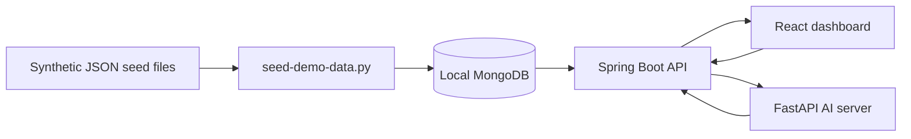

# Architecture

The demo is organized as a small full-stack ML analytics system.

## Components

- `apps/web`: React + TypeScript + Vite dashboard. It renders dashboard cards, tables, status badges, charts, and empty/loading/error states for portfolio review.
- `apps/api`: Spring Boot API. It exposes read-oriented demo endpoints, coordinates selected model execution calls, and uses localhost CORS for the Vite frontend.
- `apps/ai-server`: FastAPI service. It returns deterministic synthetic model outputs for Isolation Forest and Random Forest requests.
- `demo-data/seed`: JSON seed files with only `DEMO-*` identifiers.

## Data Flow

1. Synthetic telemetry and model metadata are stored as JSON seed files.
2. The optional seed script loads the files into a local MongoDB database.
3. The Spring Boot API reads demo collections or returns demo-safe responses.
4. The React dashboard calls the API through `VITE_API_BASE_URL`.
5. The API can call the FastAPI AI server for model execution flows.
6. Result screens show anomaly scores, health index, threshold alerts, supervised predictions, and evaluation metrics.

## Demo Boundaries

No real deployment paths, production credentials, customer data, equipment records, logs, or model artifact files are included.
