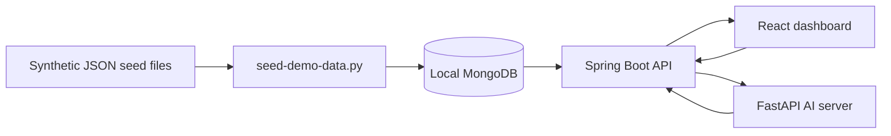

# 아키텍처

이 데모는 소규모 풀스택 ML 분석 시스템으로 구성되어 있습니다.

## 구성 요소

- `apps/web`: React + TypeScript + Vite 대시보드. 포트폴리오 검토용 대시보드 카드, 테이블, 상태 배지, 차트, 빈/로딩/에러 상태를 렌더링합니다.
- `apps/api`: Spring Boot API. 읽기 중심 데모 엔드포인트를 제공하고, 선택된 모델 실행 호출을 조율하며, Vite 프론트엔드를 위해 localhost CORS를 사용합니다.
- `apps/ai-server`: FastAPI 서비스. Isolation Forest, AutoEncoder, Random Forest 요청에 대해 결정론적 합성 모델 출력을 반환합니다.
- `demo-data/seed`: `DEMO-*` 식별자만 사용하는 JSON 시드 파일.

## 데이터 흐름

1. 합성 텔레메트리와 모델 메타데이터를 JSON 시드 파일로 저장합니다.
2. (선택) 시드 스크립트가 파일을 로컬 MongoDB에 로드합니다.
3. Spring Boot API가 데모 컬렉션을 읽거나 데모 안전 응답을 반환합니다.
4. React 대시보드가 `VITE_API_BASE_URL`을 통해 API를 호출합니다.
5. API는 모델 실행 플로를 위해 FastAPI AI 서버를 호출할 수 있습니다.
6. 결과 화면이 이상 점수, 헬스 인덱스, 임계값 알림, 지도학습 예측, 평가 지표를 표시합니다.

## 데모 경계

실제 배포 경로, 운영 인증 정보, 고객 데이터, 설비 레코드, 로그, 모델 아티팩트 파일은 포함하지 않습니다.
